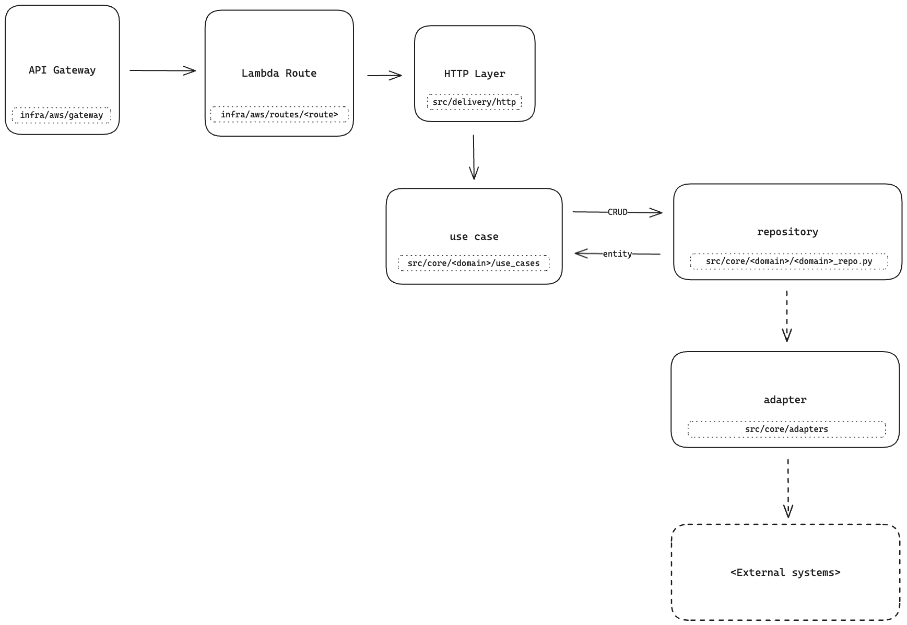

<div align="center">
    </img>
</div>

[](https://github.com/little-birdie/webapi/actions/workflows/build-and-deploy-manual.yml)
[](https://github.com/little-birdie/webapi/actions/workflows/build-and-deploy.yml)
[](https://github.com/little-birdie/webapi/actions/workflows/test-smoke-uat.yaml)
[](https://github.com/little-birdie/webapi/actions/workflows/test-smoke.yml)
[](https://github.com/little-birdie/webapi/actions/workflows/lint.yml)
[](https://github.com/little-birdie/webapi/actions/workflows/test-unit.yml)

---

## Introduction

---

This is a backend API application that powers the Little Birdie website.

Currently the functionality/API is duplicated from the Ruby on Rails
Application [(code link)](https://github.com/little-birdie/project-deal-apps).

The aim is to decommission the Ruby on Rails application and replace it with
this application.

---

## Set up for local development

---

##### 1. Install python `3.11`

Recommended to use a python version manager.
eg. [pyenv](https://realpython.com/intro-to-pyenv/) or
[asdf](https://asdf-vm.com/)

##### 2. Create virtual environment

```commandline
python -m venv .venv
```

##### 3. Activate your virtual environment

```commandline
source .venv/bin/activate
```

##### 4. Install dependencies

```commandline
make install_deps_all
```

##### 5. Update `.env` file with values

This file contains secrets to be able to run application locally intergrated
with the UAT environment. (_reach out to another developer for values to
replace_)

##### 6. Disable tracking of `.env`. This ensures any changes to file will not be tracked/committed

```commandline
git update-index --skip-worktree .env
```

##### 7. Start local server

```commandline
make start_local
```

This will start a HTTP server on `http://localhost:8001`

##### 8. Test server is up and running

```commandline
curl http://localhost:8001/api/healthcheck
```

---

## Testing

---

Currently there are two types of test.

##### Smoke tests

This are HTTP API tests that are run against the application
to ensure the application is running as expected.

##### Unit tests

This tests run modules in isolation, generally, to test the numerous
permutations of code.

#### Strategy

There is a preference of writing Smoke tests over unit test.
Since our smoke test are at the API level, this gives us the ability to go
through code changes without much changes to the testing code. It also provides
more close to production like feedback as it will run code integrated with
each other as well as the external dependencies.

There is a trade off with this strategy as it is slower than unit tests,
require external dependencies to be up and running and can be flaky.

#### API Testing (smoke test)

A [Bruno](https://docs.usebruno.com/manifesto.html) collection named `Webapi`
has been writen as smoke test for the application. You can run the test suit
with the environment selected `webapi-<env>` to test the env you would like to
run against.

You can install the Bruno GUI similar to Postman [here](https://www.usebruno.com/downloads)

Additionally, you can install the CLI
([here](https://docs.usebruno.com/cli/overview.html)) and run the test suit
with the following command:

```commandline
make test_smoke_local
```

#### Dockerised API Testing

A docker compose file has been written to make testing easy with one command.
This will build and start the webapi container and run the Bruno collection
against.

This test is better feedback to what is running in production.

To run:

```commandline
make test_smoke_docker
```

---

## CI/CD

---

### Smoke API tests

With every push the github action workflow
`./.github/workflows/test-smoke-local.yml` will run on the branch.

This workflow will start the application in a docker container and run the
Bruno API collection against the app.

## Code Structure

---

```text
.
├── infra                         - Contains all infrastructure config/code for application
│   └── aws                       - Contains AWS related infrastructure
├── src                           - Application source code
│   ├── common                    - Common code across other source folders
│   ├── delivery                  - Code that is related to the delivery of the code application
│   │   └── http                  - Contains HTTP layer code
│   ├── adapters                  - Contains adapters relating to integrations with external systems
│   └── core                      - Code that is core to the application
│       ├── common                - Common code that is used across domains eg. Base classes
│       ├── <domain>              - Contains all code related to a domain
│       │   ├── use_cases         - Contains all use cases for the domain
│       │   ├── entities          - Model entities for the domain
│       │   └── <domain>_repo.py  - Repository abstracting the storage & retrieval of domain entity
│       └── ...                   - Other domains
└── tests                         - Contains numerous type of tests
    ├── smoke                     - Smoke HTTP API tests
    ├── unit                      - Unit tests for src code
    └── ...                       - Other types of tests
```

---

### Software Architecture Segregations

---

The application is divided into 2 main layers:

1. **Delivery Layer**:
   Currently we only support a HTTP RESTful delivery layer.
   This layer is responsible for handling the incoming HTTP requests and returning
   the response. There should be no business
   logic that is running here. In other words, the main purpose of this layer
   is to take incomming request, parse it, pass it to the core layer, then finally,
   parse the core layers response to the delivery layer response.

2. **Core Layer**:
   This layer contains the business logic of the application.
   It is independent of the delivery layer. i.e. There should be no specific
   import of any delivery layer code or concepts such as HTTP/headers etc.
   This is intended so that we can easily adopt any other
   methods of delivery such as gRPC, GraphQL etc. without major changes.

   The core layer is divided into domains, each with its own folder.
   Domains generally contain the following modules:

   1. **entities**:
      These contain the model entities for the domain,
      which included the field attributes and constraints.

      All entities should defined in the `src.core.<domain>.entities.py` file
      and inherit `BaseEntity` from `src.core.common.entities`.

   2. **repositories**:
      These modules are used to store and retrieve the domains entities.
      It provides an abstraction of persistence and retrieval of the
      underlining technologies that are used to store the data.
      **e.g.** SQL, Postgres, Open Search, etc.

      CRUD operations on entities should only be performed through its
      respective repository. **e.g.** To fetch a `Store` entity, the `StoreRepo`
      should be used.

      Repositories should have the naming convention `<domain>Repo`, found
      in the `src.core.<domain>.<domain>_repo.py` file.

   3. **use case**:
      These module contains the business functions that are allowed to be
      performed on the domain entities. It contains mostly business logic
      and uses other repositories to perform its business logic.

      Use cases should be defined in the `src.core.<domain>.use_case.py` file.



---

## Dependencies

---

### Application dependencies

The FastAPI application dependencies defined in the root `requirements.txt`.
**This file should not be touched**.

We use `pip-compile` to manage this file.
`requirements.in` is where application dependencies are specified
and `pip-compile` is run on this file to
generate `requirements.txt` with its packages and locked versions.

See Makefile with commands.

### Development dependencies

Similar to the application dependencies however `requirement-dev.in` is used.

### Upgrading dependencies

`pip-compile` is used to upgrade dependencies.

See `Makefile` for commands to run.

---

## Scaling Requirements

---

The following are some back of napkin calculations on the scaling requirements for the Rails application.
This data was collected on 2024-04-22 with data within a year's period.

**Note.** Data granularity is only available the closer is it to the current date.
i.e. 1 year old data can only be using 1 hour blocks, while 1 day old data can be using 1 minute blocks.
Due to this limitation, larger time frames (5 minute, 1 hour etc.) the TPS (transactions per second) metric is highly _inaccurate_ for a given second.

### Usual day to day traffic

This is defined as the traffic that is expected on a day to day basis.

**Number of Requests**

Minimum number of request over 1 minute. 73 requests = ~1.1 TPS

Maximum number of request over 1 minute. 4.3k requests = ~71 TPS

**Active number of connections**

Minimum average over 1 minute. 20 connections = ~0.3 a second

Maximum average over 1 minute. 53 connections = ~0.9 a second

**Response time average**

Minimum average over 1 minute 0.04 seconds

Maximum average over 1 minute 1.84 seconds

### 2024-03-28 PR event

Little Birdie appeared on TV. [Slack announcement link](https://littlebirdie-au.slack.com/archives/C0254H0TD5F/p1711573743911709)

**Number of requests**

Maximum number of request over 5 minute period. ~90k requests = ~300 TPS

Before the spike it was sitting around 1k - 2k request = 3.3 - 6.6 TPS

Within a 5 minute window the request went up to total of 64k requests 213 TPS

**Active number of connections**

Maximum average over 1 minute. 500 connections = 8.3 a second

**Response time average**

From 0.05 to 1.5 seconds

### 2023-07-20

It it not clear what event this was but it was the highest peak data within a years time frame.

**Note.** The below metrics are using 1 hour intervals therefore can be inaccurate
and misleading compared to using 1 minute intervals.

**Number of Requests**

Maximum total request over 1 hour period was ~10mil = 2,777TPS
Before the spike it was sitting around 46k - 70k requests = 13 - 19 TPS

**Active number of connections**

Initially 30k = 8 a second
Spiked to 626k = 173 a second

**Response time average**

From 0.07 to 1.90 seconds. **Note.** This is an average over 1 hour. If the data was more granular I suspect the average would be _much_ higher peak average.

### Requirements summary of the data

**Minimum TPS**: ~70 TPS to support daily maximum traffic

**Maximum TPS**: ~2.7k TPS to support peak traffic

**Minimum connections**: ~50 active connections a second during daily maximum traffic

**Maximum connections**: ~170 active connections a second during peak maximum traffic

### Load testing baseline

---

The following results are from running containers with 0.25vCPU and 512MB memory, the smallest container size available.

The test scenario was run against all the endpoints that are used on the frontend homepage. This means **no open search endpoints** were tested. With all endpoint hitting the database. During this time there was no caching implemented.

#### 1 bot load test

[Link to Loadster results](https://loadster.app/dashboard/reports/n3152QJJHOatg8o5)

**Test Set up**

One concurrent bot over 3 minutes

**Results**

_Total hits:_ 7k

_Average latency:_ 0.023s

_p50:_ 0.021s

_p99:_ 0.030 s

With one container this test was to see that the best case latency was. This test result should be used as a baseline to see best case scenario latency

#### 4 bot load test

Link to Loadster results](https://loadster.app/dashboard/reports/0J5No5gsMFbWdOq5)

**Test Set up**

Four concurrent bot over 3 minutes

**Results**

_Total hits:_ 14k

_Average latency:_ 0.043s

_p50:_ 0.025s

_p99:_ 0.088s

Comparing the results against the previous above test, we can deduce that 14k hits over 3 minutes (77 TPS) is the maximum that can be handled with one container.

Numerous more test were run with greater number of bots and the results were consistent with the above results.
Each increase in bots resulted in a flat line hits and increase in latency.

---

## Scaling Configuration

---

### Requirements

Based on the above load test we can generalise that each container configured with 0.25vCPU and 512MB memory can handle at most 77 TPS.

This mean 1-2 containers will be sufficient to handle the daily maximum traffic of 70 TPS.

While ~40 containers will be required to handle the peak traffic of 2.7k TPS.

**Note.** This currently does not take into account acceptable latency.

### Costing estimations as of 2024-04-22)

[AWS Fargate pricing link](https://aws.amazon.com/fargate/pricing/)

Assuming region is Sydney using linux/x86 the cost is the following:

per vCPU per hour: $0.04856

per GB per hour: $0.00532

Assuming we are using smallest container size of 0.25vCPU and 512MB memory.

Cost per container per hour: $0.01214 (cpu) + $0.00266 (memory) = $0.0148

Minimum cost if using 2 containers = **~$10 a month** = **~$130 a year**

### Autoscaling code configuration

Terraform configuration is found in `infra/aws/gateway/scale` - [Github link](https://github.com/little-birdie/webapi/blob/main/infra/aws/gateway/scale.tf)

Based on the above historic requirements the following autoscaling strategy is implemented (as of 2024-04-22).

**Step scaling** - using percentage based step. [AWS User guide](https://docs.aws.amazon.com/autoscaling/application/userguide/step-scaling-policy-overview.html)

This is an ideal strategy as it allows for percentage based scaling, which is more effective than fixed values when there are larger number of nodes.

**e.g.** If there is currently 100 nodes and the step up policy configures 30%, the policy will scale up to 130 nodes.
If a fixed value was used, it would need to scale multiple times to reach the same number of nodes.

See Terraform code for more details configuration. [Github link](https://github.com/little-birdie/webapi/blob/main/infra/aws/gateway/scale.tf)

---

## How to contribute

---

- Clone repository and create a new branch
- Develop and commit changes
- Ensure tests are written to cover changes
- Push changes to remote branch
- Raise a draft PR
- Check if feature branch CI passes (should be visible in draft PR)
- Mark PR as ready for review
- Once approve, merge PR
- Check main branch CI passes
- (**optional**) Deploy to production with Github action [workflow](https://github.com/little-birdie/webapi/actions/workflows/build-and-deploy-manual.yml?query=branch%3Amain)
